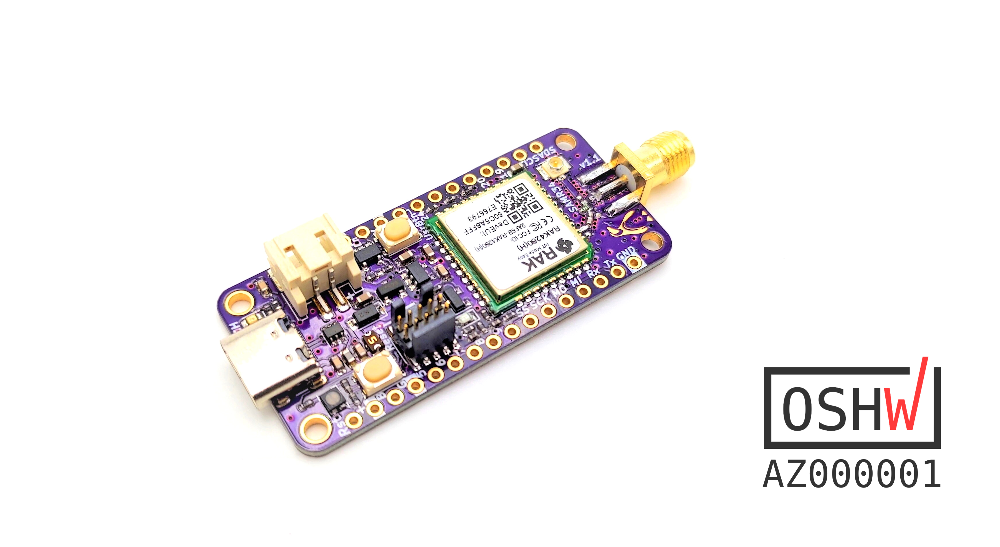

# Penguino-RAK4260
This repo contains all the necessary design and fabrication files for the Penguino 4260 SAMR34 Feather breakout board. 

First prototypes are being sold on [Tindie](https://www.tindie.com/products/21143/) and some more info can also be found on the corresponding [hackaday.io](https://hackaday.io/project/168876-penguino-feather-samr34-lora-dev-board) project page.

________________________________

### Current HW version is:
Penguino Feather v1.1.

________________________________

## License:
- Hardware license: CERN-OHL-S v2
- Software license: under MIT unless otherise indicated 
- Documentation license:  CC BY-SA 4.0 International.
________________________________
## Open Source Hardware
This board is an OSHWA approved design: [AZ000001](https://certification.oshwa.org/az000001.html)
